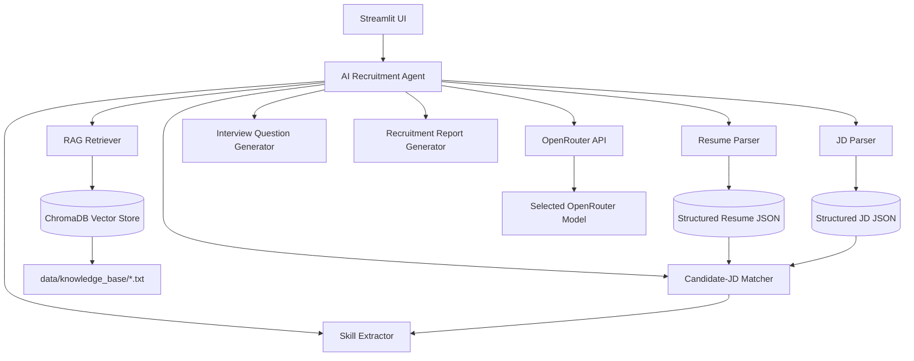

# AI HR Recruitment Assistant

## Project Overview

The AI HR Recruitment Assistant is a Streamlit application that helps HR
professionals screen resumes, analyze job descriptions, match candidates to
roles, identify skill gaps, generate personalized interview questions, and
produce a downloadable recruitment report — all backed by a **free
OpenRouter model**, so it runs on a normal student laptop with no local GPU
or Ollama installation required.

> ⚠️ This is an **AI-assisted recruitment support tool**, not a final
> hiring decision-maker. Every score, gap analysis, and recommendation is
> decision support only — a human recruiter should always review it before
> any hiring action is taken.

---

## Features

- **Resume Upload & Parsing** — Upload a PDF/DOCX resume; the LLM extracts
  name, education, experience, job history, skills, certifications, and
  projects into structured JSON. Invalid, empty, or unsupported files are
  handled gracefully with clear error messages.
- **Job Description Analysis** — Paste or upload a JD; the LLM extracts
  required skills, preferred skills, technical requirements, soft skills,
  qualifications, experience, and responsibilities.
- **Candidate-JD Matching** — A 0–100% match score blending semantic
  similarity, skill overlap, and experience fit, with a plain-language
  explanation covering strong areas, partial matches, missing requirements,
  relevant experience, and potential concerns.
- **Skill Gap Analysis** — Skills categorized as Strong Match / Partial
  Match / Missing using sentence-embedding similarity, plus a
  skill-by-skill comparison table (Skill | Candidate | Requirement | Status).
- **AI Recruitment Agent** — A tool-calling agent (via OpenRouter's
  OpenAI-compatible function calling) that reasons over the loaded
  candidate/job data and decides which modular tool to call: recompute the
  match, search the knowledge base, regenerate interview questions, or
  produce a recommendation.
- **Interview Question Generator** — Personalized Technical, Behavioral,
  Role-Specific, and Skill-Gap questions, each with a relevance note,
  evaluation points, and what a strong answer looks like — grounded in a
  RAG knowledge base of interview guidelines.
- **Recruitment Recommendation** — Strongly Recommend / Recommend /
  Consider / Not Recommended, explained using only job-relevant
  information. Protected/sensitive characteristics are explicitly excluded
  from every prompt, and ignored if present in the resume.
- **RAG Knowledge Base** — Text documents (interview guidelines, skill
  definitions, best practices, role requirement baselines) chunked,
  embedded, and retrieved via ChromaDB + Sentence Transformers, retrieved
  only when actually needed.
- **Downloadable Report** — A polished PDF summarizing the full analysis,
  with the AI-assisted disclaimer included.

---

## Architecture



Request flow for a full analysis:

```
Resume Upload -> Resume Parser -> Structured Resume -> Skill Extractor -> Candidate Profile
Job Description -> JD Parser -> Structured JD -> Required Skills
Candidate + JD -> Semantic Matcher -> Match Score -> Skill Gap Analysis
    -> AI Recruitment Agent -> Interview Questions -> Recommendation -> Recruitment Report
```

---

## Technology Stack

- **Streamlit** — the interactive dashboard UI.
- **OpenRouter** — cloud LLM provider used for all reasoning/generation
  tasks (parsing, explanations, interview questions, recommendations, and
  the agent's tool-calling), accessed via the OpenAI-compatible `openai`
  Python client pointed at OpenRouter's API — no local LLM/GPU needed.
- **ChromaDB + Sentence Transformers** — the RAG knowledge base: documents
  are chunked, embedded locally with `all-MiniLM-L6-v2`, and retrieved by
  similarity search.
- **PyMuPDF / python-docx** — extract raw text from uploaded PDF/DOCX files.
- **ReportLab** — renders the final PDF recruitment report.
- **python-dotenv** — loads configuration from `.env` (never hard-coded).

---

## Project Structure

```
ai-hr-recruitment-assistant/
│
├── app.py                     # Streamlit UI (entry point)
├── requirements.txt
├── README.md
├── .env.example
├── .gitignore
│
├── src/
│   ├── config.py               # Centralized environment/config loading
│   ├── llm.py                   # Centralized OpenRouter client + error handling
│   ├── agent.py                  # AI agent (OpenRouter tool-calling)
│   ├── resume_parser.py          # PDF/DOCX -> structured resume JSON
│   ├── jd_parser.py              # JD text/file -> structured JD JSON
│   ├── matcher.py                 # Match score, explanation, recommendation
│   ├── skill_extractor.py         # Embedding-based skill categorization
│   ├── interview_generator.py     # Personalized interview questions
│   └── report_generator.py       # PDF report builder
│   └── rag.py                     # Knowledge base ingestion + retrieval
│
├── data/
│   ├── knowledge_base/            # RAG source documents (.txt)
│   │   ├── interview_guidelines.txt
│   │   ├── skill_definitions.txt
│   │   ├── recruitment_best_practices.txt
│   │   └── job_role_requirements.txt
│   └── sample_data/                # Sample resume + JD for testing
│       ├── sample_resume.txt
│       └── sample_job_description.txt
│
├── uploads/                      # Uploaded files land here at runtime
└── reports/                      # Local report copies (optional)
```

---

## Installation

```bash
git clone <repository-url>
cd ai-hr-recruitment-assistant

python -m venv venv
```

Activate the virtual environment:

```bash
# Windows
venv\Scripts\activate

# Linux/macOS
source venv/bin/activate
```

Install dependencies:

```bash
pip install -r requirements.txt
```

Create your environment file:

```bash
cp .env.example .env
```

Open `.env` and add your OpenRouter key and model:

```
OPENROUTER_API_KEY=your_openrouter_api_key
OPENROUTER_MODEL=nex-agi/nex-n2.5-mini:free
```

Get a free key at https://openrouter.ai/keys. Free model IDs on OpenRouter
change over time — if the default above ever returns a "model not found"
error, or you see a "could not parse JSON from the model's response" error,
either:

- pick a fresh `:free`-suffixed model from https://openrouter.ai/models
  whose "supported parameters" include both `tools` (needed for the agent)
  and `response_format`/`structured_outputs` (needed for reliable JSON
  parsing/matching), or
- set `OPENROUTER_MODEL=openrouter/free`, an auto-router that always
  resolves to a currently-available free model and automatically filters
  for tool-calling support.

`src/llm.py` already asks for JSON response mode when the model supports it,
and falls back gracefully (including one corrective retry) when it doesn't —
but a model with no real structured-output support will still occasionally
produce malformed JSON, so picking a model that lists those parameters is
the most reliable fix.

Run the app:

```bash
streamlit run app.py
```

The app opens at `http://localhost:8501`. The first run downloads the
sentence-transformer embedding model (~90MB) and builds the local RAG
knowledge base — this happens once.

---

## Usage

1. Upload a candidate's resume (PDF or DOCX) in the sidebar.
2. Paste or upload a job description.
3. Click **Analyze Candidate**.
4. Parse candidate information and JD requirements automatically.
5. Review the **Overview** tab for the match score and AI explanation.
6. Check **Skill Comparison** for the skill-by-skill table and gap
   breakdown (Strong Match / Partial Match / Missing).
7. Review **Interview Questions** — technical, behavioral, role-specific,
   and skill-gap questions with evaluation guidance.
8. Check the **Recommendation** tab for the final AI-assisted call.
9. Use **Ask the Agent** for follow-up questions.
10. Download the full PDF report from the **Report** tab.

To try it quickly, use the sample resume and job description in
`data/sample_data/` — paste their contents directly into the app.

---

## API Configuration (OpenRouter)

All LLM calls go through `src/llm.py`, which builds a single OpenAI-compatible
client pointed at OpenRouter (`https://openrouter.ai/api/v1`) using
`OPENROUTER_API_KEY` and `OPENROUTER_MODEL` from `.env`. To switch models —
for example if a free model is temporarily rate-limited or unavailable —
just change `OPENROUTER_MODEL` in `.env`; no application code needs to
change. The sidebar shows live API key and model status.

---

## RAG (Retrieval-Augmented Generation)

Text files in `data/knowledge_base/` (interview guidelines, skill
definitions, recruitment best practices, role requirement baselines) are
chunked and embedded locally with Sentence Transformers, then stored in a
persistent ChromaDB collection. `retrieve_knowledge()` in `src/rag.py`
fetches the most relevant chunks for a query — this happens on demand
(e.g. when generating interview questions or when the agent calls the
`retrieve_recruitment_knowledge` tool), not on every request.

---

## Project Architecture — Module Responsibilities

| Module | Responsibility |
|---|---|
| `config.py` | Loads all environment variables; single source of truth for settings |
| `llm.py` | Centralized OpenRouter client, chat completion helpers, and all LLM error handling |
| `resume_parser.py` | Extracts text from PDF/DOCX resumes and structures it into JSON |
| `jd_parser.py` | Extracts text from JD input/files and structures it into JSON |
| `skill_extractor.py` | Embedding-based skill categorization and the skill comparison table |
| `matcher.py` | Match score computation, match explanation, and recommendation generation |
| `rag.py` | Knowledge base chunking, embedding, and retrieval via ChromaDB |
| `interview_generator.py` | Generates technical/behavioral/role-specific/skill-gap questions |
| `agent.py` | Tool-calling AI agent that orchestrates the above modules |
| `report_generator.py` | Builds the downloadable PDF recruitment report |
| `app.py` | Streamlit dashboard tying everything together |

---

## Error Handling

The app shows friendly Streamlit messages (never raw tracebacks) for:

- Missing or invalid OpenRouter API key
- OpenRouter rate limits or a temporarily unavailable/overloaded model
- Request timeouts
- Invalid or unreadable PDF/DOCX files
- Empty resumes or empty job descriptions
- Malformed/unparseable JSON responses from the model
- Missing knowledge-base documents

---

## Security

- API keys are read only from `.env` via `python-dotenv` — never hard-coded.
- `.env` is excluded via `.gitignore`; only `.env.example` (with placeholder
  values) is committed.
- Prompts explicitly instruct the model to ignore gender, race, religion,
  age, disability, nationality, sexual orientation, political affiliation,
  and other protected/sensitive characteristics, even if present in the
  resume text.
- The system is clearly labeled as AI-assisted throughout the UI and in the
  generated report, and never presents its output as an automatic final
  hiring decision.

---

## Limitations

- Free OpenRouter models vary in quality and occasionally in tool-calling
  support; if the agent's tool-calling doesn't fire, it still answers
  directly using its own reasoning.
- Parsing quality depends on how cleanly the source PDF/DOCX text extracts
  (scanned/image-only resumes without a text layer cannot be parsed).
- This is a decision-support tool. It does not replace human HR judgment,
  and all recommendations should be reviewed by a person before any hiring
  decision is made.

---

## Tech Stack Summary

Python · Streamlit · OpenRouter (OpenAI-compatible API) · ChromaDB ·
Sentence Transformers · PyMuPDF · python-docx · python-dotenv · Pandas ·
ReportLab
